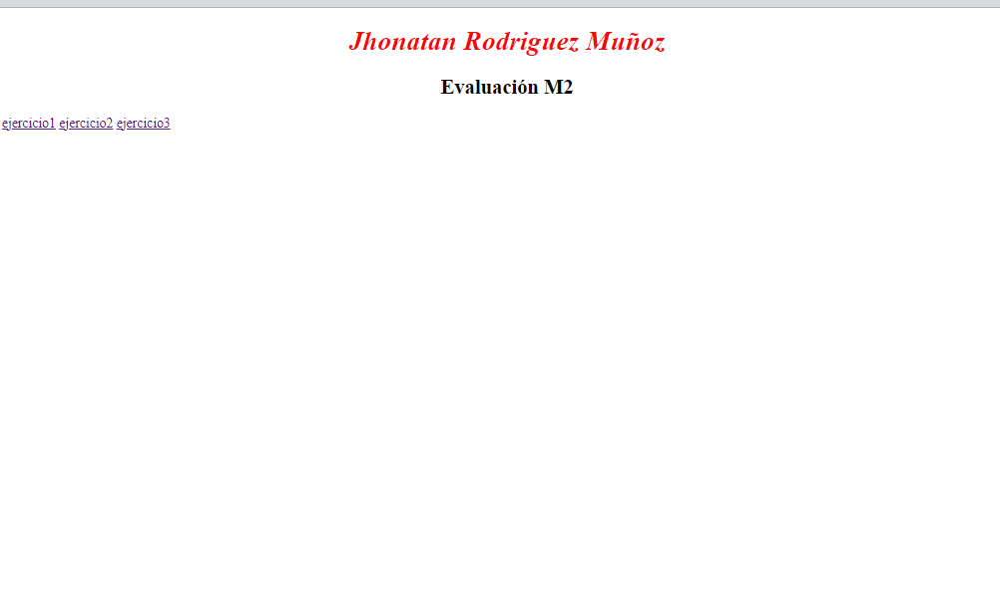
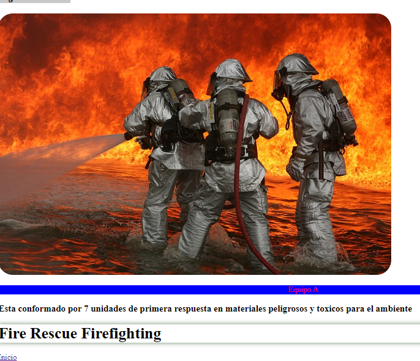
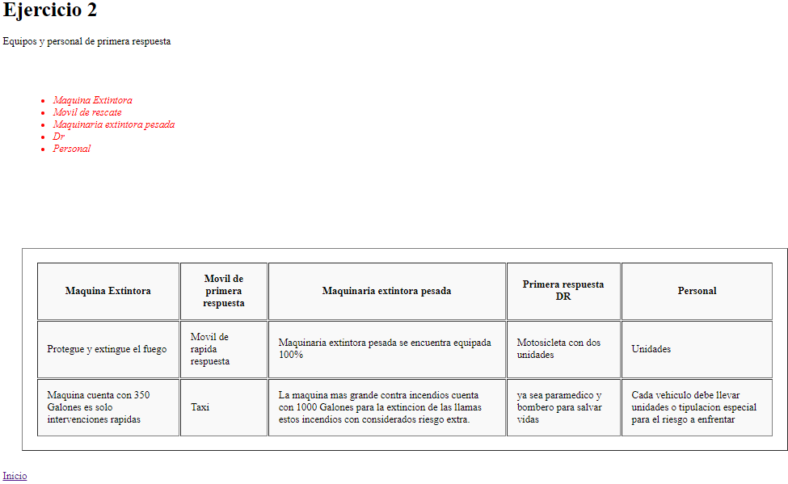

<!-- No borrar o modificar -->
[Inicio](./index.md)

## Sesión 12 

## Evaluación Momento 2

1. Evaluación de conocimiento
   
## Evaluación de conocimiento

2. Proyecto web
   
Crea un proyecto web utilizando las plantillas proporcionada (index.html, ejercicio1.html, ejercicio2.html, ejercicio3.html).

Resolver los tres ejercicios asignados.
Subir el proyecto a un repositorio en GitHub llamado “EvaluaciónM2”
Publicar el proyecto como pagina web en gitHub Page.
index.html

## DESARROLLO

[Siguiente](./sesion13.md)

