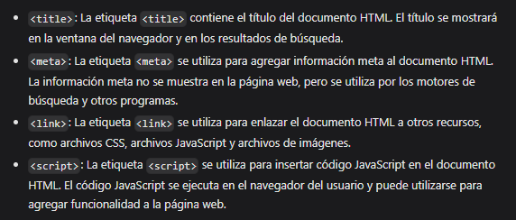
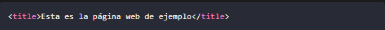
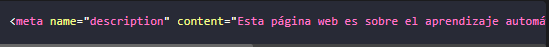
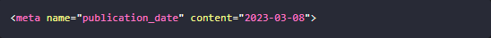
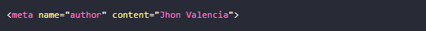
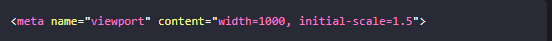
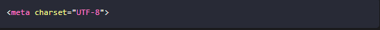
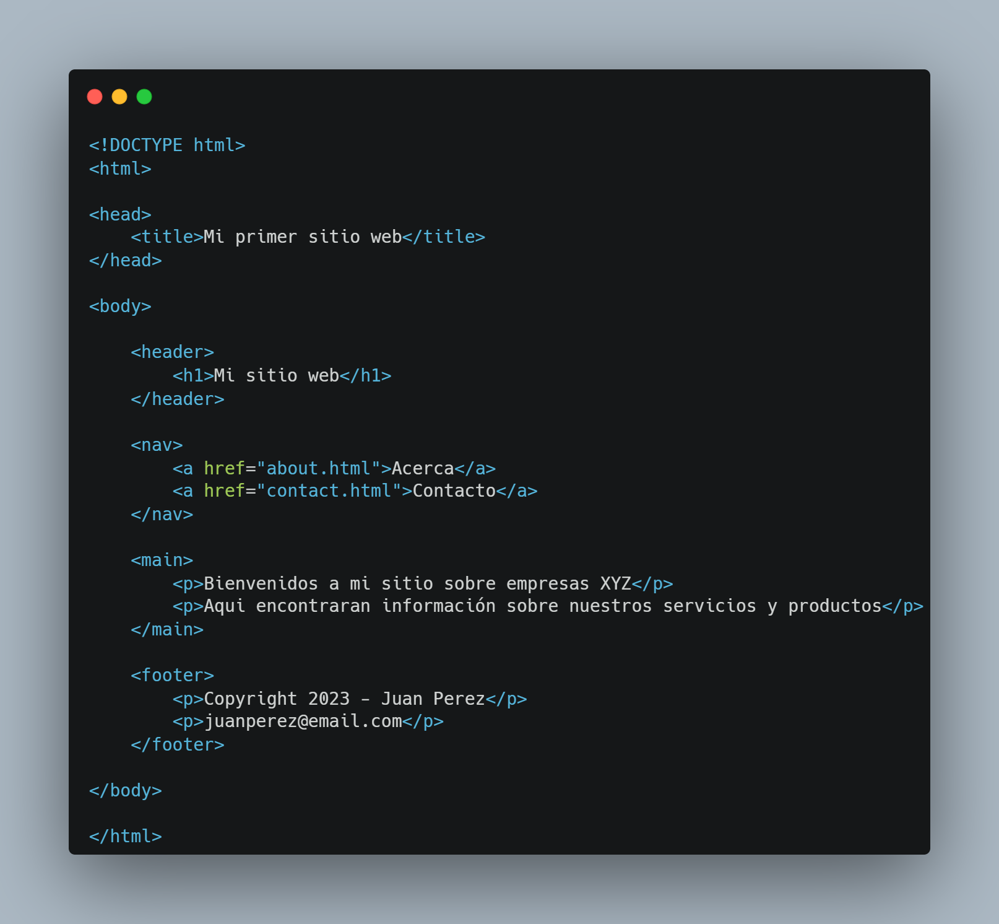
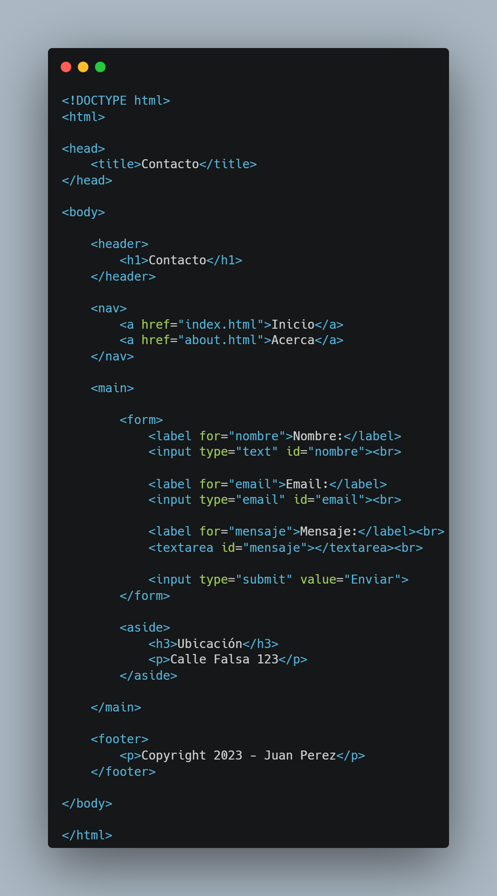

<!-- No borrar o modificar -->
[Inicio](./index.md)

## Sesión 2

<!-- Su documentación aquí -->

## Editores de código para desarrollo web

**Visual Studio Code:**

 un editor de código gratuito y de código abierto desarrollado por Microsoft. Es altamente personalizable y tiene una amplia gama de características, incluyendo soporte para HTML, CSS, JavaScript, PHP, Python, C++, y muchas otras.

* Sublime Text: un editor de código pago con una licencia perpetua. Es rápido y ligero, y tiene una amplia gama de características, incluyendo soporte para HTML, CSS, JavaScript, PHP, Python, C++, y muchas otras.

* Atom: un editor de código gratuito y de código abierto desarrollado por la comunidad. Es altamente personalizable y tiene una amplia gama de características, incluyendo soporte para HTML, CSS, JavaScript, PHP, Python, C++, y muchas otras.

* Notepad++: un editor de código gratuito y de código abierto desarrollado por la comunidad. Es rápido y ligero, y tiene una amplia gama de características, incluyendo soporte para HTML, CSS, JavaScript, PHP, Python, C++, y muchas otras.

* Brackets: un editor de código gratuito y de código abierto desarrollado por Adobe. Es altamente personalizable y tiene una amplia gama de características, incluyendo soporte para HTML, CSS, JavaScript, PHP, Python, C++, y muchas otras.

La elección del mejor editor de código para ti depende de tus necesidades y preferencias. Si eres un desarrollador web principiante, te recomiendo empezar con un editor de código gratuito, como Visual Studio Code, Sublime Text, Atom o Notepad++. Estos editores son todos fáciles de usar y tienen una amplia gama de características que pueden ayudarte a aprender desarrollo web.

## Visual Studio Code (VS Code)

Es un editor de código desarrollado por Microsoft. Se ha convertido en una de las herramientas más populares para la programación y el desarrollo de software debido a su versatilidad, rendimiento y amplia comunidad de usuarios y extensiones.

Algunas características destacadas de Visual Studio Code son:

Editor de código: VS Code ofrece un editor de código potente con resaltado de sintaxis, sugerencias inteligentes, autocompletado y muchas otras características útiles para facilitar la escritura y edición de código.

Depuración: Incluye herramientas de depuración integradas que permiten a los desarrolladores rastrear y corregir errores en su código de manera eficiente.

Integración con Git: Ofrece una sólida integración con sistemas de control de versiones, como Git, lo que facilita la gestión de cambios en el código y la colaboración en proyectos.

Extensiones: Una de las características más poderosas de VS Code es su capacidad para ser extendido mediante extensiones. Hay una amplia gama de extensiones disponibles en el mercado que agregan funcionalidades adicionales, como soporte para diferentes lenguajes de programación, herramientas de desarrollo específicas, temas visuales y más.

Terminal integrada: Proporciona una terminal integrada en la que los desarrolladores pueden ejecutar comandos y scripts directamente desde el IDE.

Vista en pantalla dividida: Permite dividir la ventana del editor en múltiples paneles para trabajar en varios archivos o secciones de código al mismo tiempo.

Integración en la nube: VS Code se puede integrar con servicios en la nube y entornos de desarrollo remoto, lo que permite a los desarrolladores trabajar en proyectos alojados en servidores remotos.

Soporte para múltiples lenguajes: Aunque VS Code es muy utilizado para desarrollo web, también ofrece soporte para una amplia variedad de lenguajes de programación y tecnologías.

Personalización: Los usuarios pueden personalizar el aspecto y la funcionalidad de VS Code según sus preferencias, eligiendo temas visuales, atajos de teclado y más.

Gratuito y de código abierto: Visual Studio Code es gratuito y de código abierto, lo que significa que los desarrolladores pueden acceder al código fuente, contribuir con mejoras y personalizarlo según sus necesidades.

[https://code.visualstudio.com/](https://code.visualstudio.com/)

## TML5

HTML5 es la quinta versión del lenguaje de marcado de hipertexto (HTML), que se utiliza para estructurar y presentar contenido en la web. HTML es el lenguaje fundamental utilizado para crear páginas web y definir su estructura y contenido. HTML5 trajo consigo una serie de mejoras y nuevas características en comparación con las versiones anteriores de HTML, lo que lo convirtió en un estándar ampliamente adoptado para el desarrollo de sitios web y aplicaciones web.

Algunas de las características y mejoras más importantes de HTML5 incluyen:

* Elementos semánticos: HTML5 introduce nuevos elementos semánticos que permiten a los desarrolladores etiquetar el contenido de una manera más significativa. Esto ayuda a los motores de búsqueda y a los navegadores a comprender mejor la estructura del contenido y su contexto.

* Compatibilidad multimedia mejorada: HTML5 incluye elementos como audio y video que permiten la incorporación de contenido multimedia sin necesidad de complementos o tecnologías externas, como Adobe Flash.

* Canvas y gráficos: HTML5 presenta el elemento canvas, que permite a los desarrolladores dibujar gráficos, animaciones y otros elementos visuales directamente en la página utilizando JavaScript.

* API de arrastrar y soltar: HTML5 introdujo la posibilidad de arrastrar y soltar elementos en una página web, lo que facilita la implementación de interacciones intuitivas.

* WebSockets: Esta tecnología permite la comunicación bidireccional en tiempo real entre un navegador y un servidor, lo que es especialmente útil para aplicaciones en tiempo real como chats y juegos multijugador.

* Almacenamiento local: HTML5 proporciona métodos para almacenar datos en el lado del cliente, como el almacenamiento local y las bases de datos en el navegador, lo que permite a las aplicaciones funcionar sin conexión o de manera más eficiente.

* Mejoras en formularios: HTML5 simplifica la creación de formularios web y agrega nuevos tipos de campos, validaciones y características de autocompletado.

* Geolocalización: HTML5 permite a las aplicaciones web acceder a la ubicación geográfica del dispositivo del usuario, lo que es útil para servicios basados en la ubicación.

* Accesibilidad mejorada: HTML5 promueve la creación de contenido web más accesible al proporcionar atributos y elementos diseñados para mejorar la experiencia de los usuarios con discapacidades.

* Compatibilidad móvil: HTML5 se diseñó teniendo en cuenta los dispositivos móviles, lo que facilita la creación de sitios web y aplicaciones que funcionen bien en pantallas de diferentes tamaños y dispositivos móviles.

## Elemento HTML

Un elemento HTML es una etiqueta que se utiliza para estructurar el contenido de una página web. Los elementos HTML se utilizan para crear elementos de contenido, como párrafos, encabezados, tablas, imágenes y enlaces.

Cada elemento HTML tiene un nombre y una apertura y cierre de etiqueta. El nombre del elemento es el texto que aparece entre los símbolos de menor y mayor (< y >). La apertura de la etiqueta se llama etiqueta de apertura y la cierre de la etiqueta se llama etiqueta de cierre.

Por ejemplo, el elemento HTML para un párrafo es 
. La etiqueta de apertura es 
 y la etiqueta de cierre es 
.

Los elementos HTML se pueden anidar, lo que significa que se pueden colocar uno dentro del otro. Esto permite crear estructuras complejas de contenido web.

Los elementos HTML son una parte importante del lenguaje HTML. Se utilizan para crear la estructura de una página web y para mostrar el contenido de una página web.

## Anidamiento de elementos HTM

El anidamiento de elementos HTML es el proceso de colocar un elemento HTML dentro de otro elemento HTML. Este es un concepto importante en el lenguaje HTML, ya que permite crear estructuras complejas de contenido web.

Para anidar elementos HTML, simplemente abre el elemento padre y luego abre el elemento hijo dentro del elemento padre. Cuando hayas terminado de usar el elemento hijo, ciérralo.

Por ejemplo, el siguiente código muestra cómo anidar un elemento p dentro de un elemento div:

El elemento div es el elemento padre y el elemento p es el elemento hijo. El elemento p se encuentra dentro del elemento div.

Puedes anidar elementos HTML de cualquier manera que desees. Sin embargo, es importante tener en cuenta que la estructura de tu contenido web debe ser lógica y fácil de entender.

El anidamiento de elementos HTML puede ser una herramienta poderosa para crear estructuras complejas de contenido web. Sin embargo, es importante usarlo de manera responsable.

## Comentarios HTML

Los comentarios HTML son una forma de agregar notas al código HTML que no se mostrarán en la página web. Se pueden usar para proporcionar información sobre el código, explicar el propósito de una sección de código o simplemente para hacer anotaciones.

Los comentarios HTML se escriben entre el símbolo de signo menos (-) y el signo mayor (>). Pueden ser una línea o múltiples líneas.

Un comentario de una sola línea se vería así:

Un comentario de varias líneas se vería así:

## Estructura básica de un documento HTML5

La estructura básica de un documento HTML5 consta de las etiquetas esenciales que proporcionan la base para crear una página web. 

Aquí tienes un ejemplo de cómo se vería la estructura básica:

### Explicación:

  
## < !DOCTYPE html >

La declaración de tipo de documento (DOCTYPE) es una declaración de texto que indica al navegador cómo interpretar el código HTML de una página web. La declaración DOCTYPE debe ser la primera línea de código en un documento HTML.

Hay muchos tipos diferentes de declaraciones DOCTYPE, pero la más común es la siguiente:

Esta declaración DOCTYPE indica al navegador que la página web está escrita en HTML5, la última versión del lenguaje HTML.

La declaración DOCTYPE es importante porque ayuda a garantizar que la página web se muestre correctamente en todos los navegadores. Sin una declaración DOCTYPE válida, el navegador puede no poder interpretar el código HTML de la página web correctamente y la página puede no mostrarse correctamente.

## <html>

La etiqueta HTML <html> es la etiqueta raíz de un documento HTML. Marca el comienzo y el final del documento HTML.

La etiqueta <html> debe ser la primera etiqueta en un documento HTML y debe cerrarse con la etiqueta </html>.

La etiqueta <html> no tiene ningún contenido, pero puede contener las etiquetas <head> y <body>.

## <head>

La etiqueta HTML <head> es una sección de un documento HTML que contiene información sobre el documento, como el título, las palabras clave y la descripción. La etiqueta <head> debe ser la primera etiqueta en un documento HTML y debe cerrarse con la etiqueta </head>.

La etiqueta <head> no contiene ningún contenido, pero puede contener las siguientes etiquetas:

 

   **La etiqueta <head> es importante porque ayuda a estructurar un documento HTML y a proporcionar información sobre el documento al navegador.**  

## <body>

La etiqueta HTML <body> es una sección de un documento HTML que contiene el contenido visible de la página web, como el texto, las imágenes y los formularios. La etiqueta <body> debe estar entre las etiquetas <html> y </html>.

## Etiquetas <meta>

Las etiquetas meta HTML son etiquetas HTML que proporcionan información adicional sobre una página web. Se utilizan para ayudar a los motores de búsqueda a entender el contenido de una página web y para mostrar la página web en los resultados de búsqueda.

Las etiquetas meta HTML se suelen colocar en la sección <head> de una página web. La sección <head> es la parte de una página web que no se muestra en el navegador web.

Las etiquetas meta HTML se utilizan para proporcionar información sobre una variedad de temas, como el título de la página web, la descripción de la página web, las palabras clave de la página web, la fecha de publicación de la página web, el autor de la página web, y la licencia de la página web.

Las etiquetas meta HTML no son visibles para los usuarios, pero pueden ser muy útiles para los motores de búsqueda y para los usuarios que quieren saber más sobre una página web.

Aquí hay algunos ejemplos de etiquetas meta HTML:

## title

La etiqueta < title> se utiliza para especificar el título de una página web. El título se muestra en la barra de título del navegador web y en los resultados de búsqueda.

## description

La etiqueta <meta name="description" content=""> se utiliza para especificar una descripción de una página web. La descripción se muestra en los resultados de búsqueda. 

## keywords

La etiqueta <meta name="keywords" content=""> se utiliza para especificar las palabras clave de una página web. Las palabras clave se utilizan por los motores de búsqueda para encontrar páginas web.

## publication_date

La etiqueta <meta name="publication_date" content=""> se utiliza para especificar la fecha de publicación de una página web. La fecha de publicación se utiliza por los motores de búsqueda para ordenar las páginas web en los resultados de búsqueda.

## author

La etiqueta <meta name="author" content=""> se utiliza para especificar el autor de una página web. El autor se utiliza por los motores de búsqueda para mostrar información sobre el autor de una página web en los resultados de búsqueda.

## license

La etiqueta <meta name="license" content=""> se utiliza para especificar la licencia de una página web. La licencia se utiliza para informar a los usuarios sobre los derechos de autor de una página web.

< meta name="license" content="Creative Commons Attribution-ShareAlike 4.0 International License">

## viewport

El viewport es el área de una página web que se muestra en el navegador. Se puede definir como el área rectangular dentro del navegador que contiene el contenido de la página web. El viewport se puede ajustar en tamaño y posición, y se puede utilizar para mejorar la experiencia de visualización de la página web en diferentes dispositivos. Por ejemplo, la siguiente etiqueta meta HTML viewport establece el viewport en 1000 píxeles de ancho y una escala inicial de 1.5:

## charset

La etiqueta <meta charset="UTF-8"> es una etiqueta HTML que especifica la codificación de caracteres para el documento HTML. Le dice al navegador cómo interpretar el texto en la página para que se muestre correctamente. El atributo charset especifica la codificación de caracteres a utilizar. La codificación de caracteres más común es UTF-8, que puede representar casi todos los caracteres y símbolos del mundo.

Las etiquetas meta HTML son una parte importante del lenguaje HTML. Se utilizan para proporcionar información adicional sobre una página web que puede ser útil para los motores de búsqueda y para los usuarios.

## DESARROLLO

### Actividad: Creando mi primer sitio web

Crea un sitio web compuesto por 3 páginas HTML utilizando la estructura y los elementos que has aprendido. Personaliza el sitio y utiliza diferentes etiquetas HTML.

Las páginas del sitio serán:

Index o página de inicio
Acerca
Contacto

### index.html

### about.html

### contact.html

