<!-- No borrar o modificar -->
[Inicio](./index.md)

## Sesión 7 

¿Qué es Git?

[Git](https://git-scm.com/.9)

Git es un sistema de control de versiones de código, que permite a los desarrolladores llevar un registro de los cambios realizados en el código de un proyecto. Con Git, los desarrolladores pueden trabajar de manera colaborativa en un mismo proyecto, mantener diferentes versiones del código, y resolver conflictos de manera eficiente.

Git fue creado en 2005 por Linus Torvalds, el creador del sistema operativo Linux, y se ha convertido en uno de los sistemas de control de versiones más utilizados en el mundo. Con Git, los desarrolladores pueden llevar un registro completo del historial de cambios en el código, revertir a versiones anteriores en caso de ser necesario, y colaborar de manera eficiente con otros desarrolladores en el mismo proyecto.

Git es un software libre y de código abierto, lo que significa que está disponible gratuitamente para todos y que cualquier persona puede contribuir al desarrollo y mejora del software. Además, Git es compatible con una amplia gama de sistemas operativos, incluyendo Windows, MacOS y Linux.

## ¿Qué es GitHub?

[GitHub](https://github.com/.)

GitHub es una plataforma en línea para alojar y colaborar en proyectos de software. Fue fundada en 2008 y es una de las plataformas más populares para alojar proyectos de código abierto.

En GitHub, los desarrolladores pueden crear y alojar proyectos, colaborar con otros desarrolladores en proyectos existentes, hacer seguimiento a errores y problemas, y compartir y discutir ideas.

GitHub utiliza Git, un sistema de control de versiones de software, para llevar un registro de todos los cambios en los proyectos y permitir a los desarrolladores trabajar juntos en un proyecto sin interferir entre sí.

Además de alojar proyectos de código abierto, GitHub también ofrece planes de pago para equipos y organizaciones que desean alojar proyectos privados y obtener más características avanzadas.

## Instalación de Git en diferentes sistemas operativos

Para instalar Git en diferentes sistemas operativos, puedes seguir los siguientes pasos:

* En Windows: Descarga el instalador de Git desde el sitio web oficial de Git [ps://git-scm.com/download/win](ps://git-scm.com/download/win) y sigue las instrucciones del instalador.

* En macOS: Instala Git utilizando Homebrew [https://brew.sh/](https://brew.sh/) ejecutando el siguiente comando en la terminal: brew install git

* En Linux: Utiliza el gestor de paquetes de tu distribución para instalar Git. Por ejemplo, en Ubuntu puedes ejecutar el siguiente comando en la terminal: sudo apt-get install git

## Conceptos básicos de Git: repositorios, commits, ramas, fusiones, etc.

Repositorios: son los lugares donde se almacenan los archivos de un proyecto. Los repositorios pueden ser locales (en tu computadora) o remotos (en un servidor).

Commits: son los cambios que se realizan en los archivos de un proyecto. Cada commit tiene un mensaje que describe los cambios realizados.

Ramas: son diferentes versiones del proyecto que se crean a partir de la rama principal (también conocida como rama maestra o master). Las ramas permiten trabajar en diferentes versiones del proyecto de manera independiente.

Fusiones: son la combinación de dos o más ramas en una sola. Las fusiones permiten incorporar los cambios realizados en diferentes ramas en una sola versión del proyecto

## Flujo de trabajo básico de Git

Haces cambios en tu código fuente en tu directorio de trabajo.

Preparas (añades) esos cambios al staging area, es decir, añades los cambios. Esto es lo que Git rastreará para incluirlo en tu próxima confirmación.

Confirmas los cambios, lo que crea un punto de comprobación en la historia del proyecto y almacena un commit de esos cambios de forma permanente en tu base de datos local.

(Opcional) Pushes esos commits a un repositorio remoto, como por ejemplo GitHub. Esto comparte tus commits con otros colaboradores y los hace disponibles de forma remota

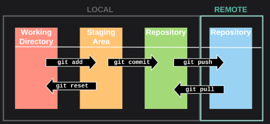

## Configuración inicial de Git

Después de instalar Git, es importante configurarlo antes de usarlo. Para configurar Git, sigue los siguientes pasos:

Abre la terminal (en Windows, utiliza Git Bash) Configura tu nombre de usuario y correo electrónico utilizando los siguientes comandos:

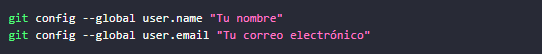

## Comprobando tu Configuración

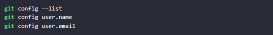

## El comando git --version

Se utiliza para verificar qué versión de Git está instalada.

## El comando git init

Se utiliza para inicializar un repositorio Git nuevo.

Cuando ejecutas git init en un directorio, Git inicializará un repositorio Git nuevo y oculto en ese directorio. Este repositorio contiene la información de Git necesaria para rastrear cambios en los archivos.

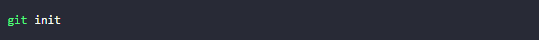

## El comando git status:

Para verificar el estado de los archivos en un repositorio Git, puedes usar el comando git status. 

Mostrará:

* Archivos sin hacer seguimiento (aún no agregados al índice)

* Archivos modificados (archivos que han cambiado pero aún no se han confirmado)

* Archivos preparados (archivos que se han agregado al índice y se confirmarán después)

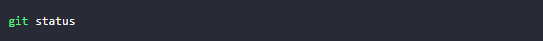

## El comando git add:

Se utiliza para agregar archivos al área de preparación (staging area) en Git. Esta área de preparación es una especie de área intermedia donde Git almacena información sobre los archivos que irán en tu próximo commit.

El uso básico es:

git add 'archivo'

Esto agregará un solo archivo al área de preparación.

También puedes:

* git add . - Agrega todos los archivos nuevos y modificados en el directorio actual

* git add -A - Agrega todos los archivos nuevos, modificados y eliminados

* git add -p - Selecciona de forma interactiva los cambios de archivos para agregar

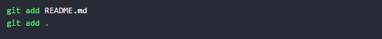

## El comando git commit

Se utiliza para guardar los cambios en el repositorio Git local.

El uso básico es:

git commit -m "mensaje del commit"

Esto confirmará todos los cambios que hayan estado preparados (agregados) usando git add. La bandera -m te permite especificar un mensaje de commit entre comillas.

Por ejemplo

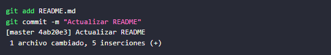

## El comando git log

Se utiliza para ver el historial de commits de un repositorio Git. Muestra información como:

* ID del commit

* Mensaje del commit

* Autor del commit

* Fecha del commit
  
* El uso básico es:

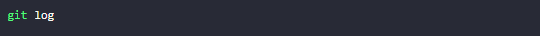

Esto mostrará todos los commits en el historial, con la información anterior.

Por ejemplo:

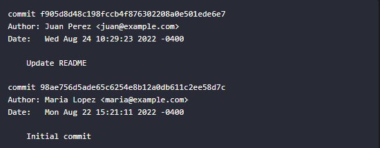

También se puede usar opciones para personalizar el formato y filtro de los resultados:

* --pretty=format: Muestra el formato deseado (abreviado, simple, etc.)

* --grep: Filtra los commits que coinciden con una expresión regular

* --author: Filtra por autor

* -n: Mostrar los últimos n commits

* --since, --until: Filtrar commits entre fechas

Por ejemplo:

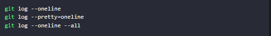

Se utiliza para mostrar un resumen de una solo línea para cada commit en el historial.

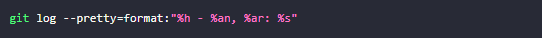

Muestra solo el hash, autor y mensaje para cada commit.

## El comando git diff

Se utiliza para mostrar las diferencias entre commits, el código actual ( Working Directory) y el código confirmado (Staging Area).

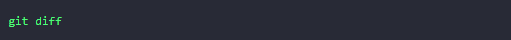

Esto mostrará las diferencias entre el código actual (sin confirmar) y el código confirmado más reciente. Muestra qué líneas se agregaron y eliminaron.

También puedes ver las diferencias entre:

* Dos commits: git diff 'commit1' 'commit2'

* El código actual y un commit específico: git diff HEAD 'commit'
Por ejemplo:

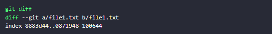

## El comando git checkout:

El comando git checkout se utiliza para cambiar la rama actual o para restaurar un archivo a un estado anterior.

La sintaxis básica del comando git checkout es:

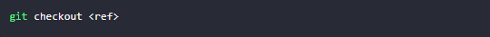

Donde < ref > es la referencia que quieres cambiar. La referencia puede ser el nombre de una rama, el hash de un commit o una etiqueta.

Por ejemplo, para cambiar a la rama main, puedes usar el siguiente comando:

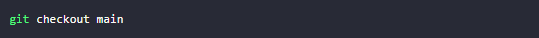

Para restaurar el archivo README.md a su estado en el commit con el hash 1234567890, puedes usar el siguiente comando:

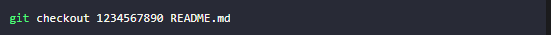

El comando git checkout tiene muchas opciones que te permiten controlar cómo se realiza el cambio. Por ejemplo, la opción --patch te permite revisar los cambios antes de que se apliquen a tus archivos.

Aquí hay algunos ejemplos de cómo usar el comando git checkout:

* git checkout main: Cambia a la rama main.

* git checkout -b feature: Crea una nueva rama llamada feature y cambia a ella.

* git checkout 1234567890: Cambia al commit con el hash 1234567890.

* git checkout README.md: Restaura el archivo README.md a su estado en el último commit.

* git checkout --patch README.md: Revisa los cambios que se realizarán en el archivo README.md antes de aplicarlos.

## GitHub

## ¿Qué es GitHub?

GitHub es una plataforma en línea que permite el alojamiento, la colaboración y el control de versiones de proyectos de software. Es ampliamente utilizada por desarrolladores de software y equipos de programación para gestionar el desarrollo y seguimiento de código fuente, realizar colaboraciones en proyectos y facilitar la colaboración en equipo.

Algunas de las características clave de GitHub incluyen:

* Repositorios: Los repositorios son espacios donde se almacena y organiza el código fuente de un proyecto. Cada repositorio puede contener archivos, carpetas, documentación y registros de cambios.

* Control de Versiones: GitHub proporciona herramientas para realizar un seguimiento de los cambios en el código a lo largo del tiempo. Los desarrolladores pueden crear "commits" para registrar cambios específicos en el código, lo que facilita el rastreo y la reversión de modificaciones.

* Colaboración: Varios desarrolladores pueden trabajar juntos en un proyecto alojado en GitHub. Pueden colaborar de manera simultánea, realizar revisiones de código, sugerir cambios y fusionar contribuciones.

* Ramificaciones (Branches): Los desarrolladores pueden crear ramificaciones separadas del código principal para trabajar en nuevas características o solucionar problemas sin afectar la versión estable del proyecto. Luego, estas ramas pueden fusionarse nuevamente en el código principal.

* Solicitudes de extracción (Pull Requests): Una solicitud de extracción es una forma de proponer cambios al código de un repositorio. Los desarrolladores pueden crear una solicitud de extracción para que otros revisen y aprueben sus cambios antes de que se fusionen en el proyecto principal.

* Wikis y Documentación: Los repositorios de GitHub pueden contener documentación en forma de wikis, archivos Markdown u otros formatos, lo que facilita la creación y el acceso a información importante sobre el proyecto.

* Integración con Herramientas: GitHub se integra con muchas otras herramientas y servicios populares de desarrollo, como servicios de integración continua, sistemas de automatización, sistemas de prueba y despliegue, y más.

## Crear un repositorio en GitHub

Dirígete a la página de inicio de GitHub y crea una cuenta si aún no tienes una.

Una vez que hayas iniciado sesión, haz clic en el botón "Crear un repositorio".

En la ventana de creación de repositorios, da un nombre a tu repositorio y selecciona si quieres que sea público o privado.

Una vez que hayas terminado, haz clic en el botón "Crear repositorio".

## Crear un nuevo repositorio en la línea de comandos

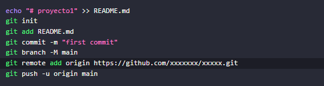

Explicación

1. echo "# proyecto1" >> README.md: Este comando crea un archivo llamado README.md en el directorio actual y agrega la línea "# proyecto1" al archivo. El >> se utiliza para redirigir la salida y anexar el contenido al archivo. Esto es comúnmente utilizado para crear un archivo de README que describa el proyecto.

2. git init: Inicializa un nuevo repositorio Git en el directorio actual. Esto crea un subdirectorio oculto llamado .git que contiene toda la información necesaria para rastrear los cambios en el proyecto.

3. git add README.md: Añade el archivo README.md al área de preparación de Git. Esto significa que Git comenzará a rastrear los cambios en este archivo.

4. git commit -m "first commit": Crea un nuevo commit (instantánea de los cambios) en el repositorio. El mensaje -m se utiliza para proporcionar una descripción breve del commit. En este caso, se está creando el primer commit con el mensaje "first commit".

5. git branch -M main: Cambia el nombre de la rama predeterminada de master a main. GitHub ha estado promoviendo el uso de la terminología más inclusiva y, por lo tanto, este comando se utiliza para actualizar el nombre de la rama principal.

6. git remote add origin : Conecta el repositorio local al repositorio remoto en GitHub. origin es el nombre convencional del control remoto. La URL proporcionada es la ubicación del repositorio remoto.

7. git push -u origin main: Sube los cambios locales al repositorio remoto en GitHub. El -u establece la rama local main para que haga un seguimiento de la rama remota main en el repositorio remoto. Después de este comando, los cambios y commits locales se copiarán en el repositorio remoto.

## Actividad: Proyecto web, git y Github

Crea un repositorio Git en GitHub y clonalo en tu computadora local. Luego, crea un proyecto web utilizando la información de las sesiones 1, 2, 3, 4 y 5. Realiza algunas modificaciones al proyecto y sube los cambios al repositorio remoto.

## Requerimientos del proyecto:

* Crea un proyecto web de diseño libre.

* Documentar el repositorio en el archivo README. md

## DESARROLLO 

<head>
    <meta charset="UTF-8">
    <meta name="viewport" content="width=device-width, initial-scale=1.0">
    <title>Document</title>
</head>

<body>
    <table border="1" cellpadding="3" cellspacing="2">
        <thead>
            <tr>
                <th rowspan="5" Cabecera<th   Codigo 061508-2023

                <th colspan="5" columna 1 </th>
                     FRUTI DELICIAS EL YEYO

            <tr>
            <tr>
                <th rowspan="5">Promociones Jueves</th>

                <th colspan="4">15.30.</th>
            </tr>

            <tr>
                <th>Verdura</th>
                <th>Subcolumna 2</th>
                <th>Subcolumna 3</th>
                <th>Subcolumna 2</th>
            </tr>

            <tr>

                <th rowspan="6">PUNTOS</th>
                <th colspan="6">Bodega principal</th>
            </tr>

        </thead>

        <thead>
            <tr>
                <th>Código</th>
                <th>Nombre</th>
                <th>Descripción</th>
                <th>Precio</th>
                <th>Stock</th>
                <th>Fecha de creación</th>
            </tr>

        </thead>
        <tbody>
            <tr>
                <td>001</td>
                <td>Manzana</td>
                <td>Fruta</td>
                <td>5.000</td>
                <td>60</td>
                <td>05-01-2023</td>
            </tr>

            <tr>
                <td>002</td>
                <td>Banano</td>
                <td>Fruta</td>
                <td>1.000</td>
                <td>507</td>
                <td>05-01-2023</td>
            </tr>

            <tr>
                <td>003</td>
                <td>Lechuga</td>
                <td>Verdura</td>
                <td>2.000</td>
                <td>208</td>
                <td>05-01-2023</td>
            </tr>

            <tr>
                <td>004</td>
                <td>Papaya</td>
                <td>Fruta</td>
                <td>3.500</td>
                <td>58</td>
                <td>05-01-2023</td>
            </tr>

            <tr>
                <td>005</td>
                <td>Zanahorias</td>
                <td>Verdura</td>
                <td>1.900</td>
                <td>420</td>
                <td>05-01-2023</td>
            </tr>

            <tr>
                <td>006</td>
                <td>Cebolla</td>
                <td>Verdura</td>
                <td>900</td>
                <td>400</td>
                <td>05-01-2023</td>
            </tr>

            <tr>
                <td>007</td>
                <td>Pimenton</td>
                <td>Verdura</td>
                <td>3.150</td>
                <td>500</td>
                <td>05-01-2023</td>
            </tr>

            <tr>
                <td>008</td>
                <td>Calabazas</td>
                <td>Verdura</td>
                <td>8.000</td>
                <td>130</td>
                <td>05-01-2023</td>
            </tr>

            <tr>
                <td>009</td>
                <td>Piña</td>
                <td>Fruta</td>
                <td>10.000</td>
                <td>80</td>
                <td>05-01-2023</td>
            </tr>

            <tr>
                <td>010</td>
                <td>Aguacate</td>
                <td>Fruta</td>
                <td>6.000</td>
                <td>75</td>
                <td>05-01-2023</td>
            </tr>
            <tr>
                <th rowspan="6">INVENTARIO</th>
                <th colspan="6">AGOSTO</th>
            </tr>

        </tbody>

    </table>

</body>

</html>

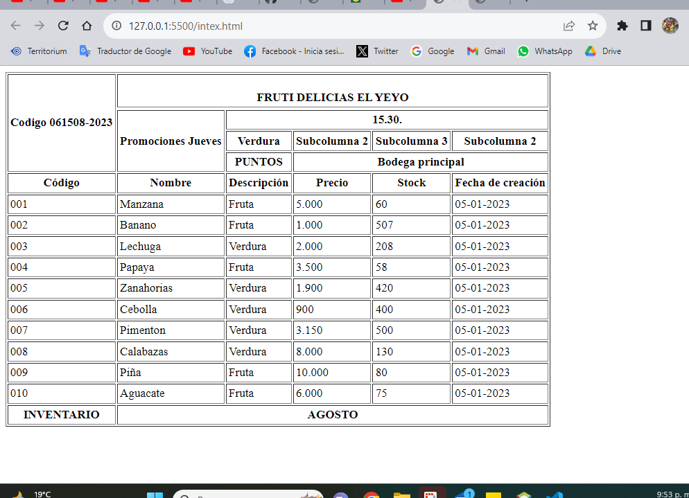

[Siguiente](./sesion8.md)

