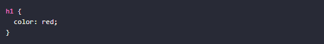

<!-- No borrar o modificar -->
[Inicio](./index.md)

## Sesión 8 

# CSS

CSS, o Cascading Style Sheets, es un lenguaje de diseño gráfico para definir y crear la presentación de un documento estructurado escrito en un lenguaje de marcado, como HTML o XML. CSS se utiliza para dar estilo a las páginas web, por ejemplo, alterando la fuente, color, tamaño y espaciado del contenido, dividiendo el contenido en múltiples columnas o agregando animaciones y otras características decorativas.

CSS es un lenguaje de hojas de estilo que se utiliza para describir cómo se mostrará un documento HTML. CSS se aplica a un documento HTML en forma de hojas de estilo. Una hoja de estilo CSS es un archivo de texto que contiene instrucciones sobre cómo se debe mostrar un documento HTML.

CSS es un lenguaje poderoso que se puede utilizar para crear diseños web muy complejos y sofisticados. Con un buen conocimiento de CSS, puede crear páginas web que sean atractivas, informativas y fáciles de usar.

# Funciones de CSS

CSS tiene una serie de funciones, entre las que se incluyen:

* Controlar el aspecto de los elementos HTML: CSS se puede utilizar para cambiar el aspecto de los elementos HTML, como su color, tamaño, fuente y posición.

* Crear layouts: CSS se puede utilizar para crear layouts de páginas web, como columnas, filas y tablas.

* Agregar efectos: CSS se puede utilizar para agregar efectos a las páginas web, como animaciones, transiciones y sombras.

* Soportar dispositivos móviles: CSS se puede utilizar para crear páginas web que se vean bien en dispositivos móviles.

# Sintaxis de CSS

La sintaxis de CSS es relativamente simple. Las reglas CSS se componen de dos partes: una selector y una declaración.

El selector identifica los elementos HTML a los que se aplicará la regla. El declaración especifica el estilo que se aplicará a los elementos seleccionados.

Por ejemplo, la siguiente regla CSS cambiará el color de todos los elementos < h1 > a rojo:

# Actividad: 

# Aplicando estilos con selectores CSS

El objetivo de esta actividad es crear la estructura HTML básica de una página web y aplicar diferentes selectores CSS para modificar su presentación.

Pasos:

Crea el esqueleto de una página web simple con la siguiente estructura:

* Encabezado <header>

* Tres párrafos 

* Una imagen 

* Un pie de página <footer>

Aplica los siguientes estilos usando selectores de etiqueta:

* Color rojo a los encabezados <h1>

* Color azul a los párrafos 

* Borde grueso negro a la imagen 

Aplica los siguientes estilos usando seleccionadores de clase:

* Color verde a los elementos con la clase ".destacado"

* Tamaño de fuente grande a los elementos con la clase ".grande"

Aplica los siguientes estilos usando seleccionadores de ID:

* Color amarillo al elemento con ID "#principal"

* Sombra al elemento con ID "#sombras"

Aplica los siguientes estilos usando seleccionadores descendientes:

* Color gris a los párrafos dentro de un 

* Centrar el contenido de la sección <section>

## DESARROLLO 

<!DOCTYPE html>
<html lang="es">
<head>
    <meta charset="UTF-8">
    <meta name="viewport" content="width=device-width, initial-scale=1.0">
    <title>Daltonismo</title>
    
</head>
<body>
    <header>
        <h1>¿Qué es el daltonismo?</h1>
    </header>

    
Si usted tiene daltonismo significa que ve los colores de manera
        diferente a la mayoría de las personas..

    
 El daltonismo casi siempre hace difícil notar
        la diferencia entre ciertos colores.

    
En el daltonismo generalmente la persona no puede distinguir entre ciertos colores.
        Con frecuencia no distinguen los verdes de los rojos y, a veces, los azules.
        En la retina hay dos tipos de células que detectan la luz. Esas células se llaman bastoncillos y conos.

        

          
            
El daltonismo o, más exactamente, la visión de color mala o deficiente, es una incapacidad para ver la diferencia entre ciertos colores.
                Aunque mucha gente usa comúnmente el término "daltonismo" para esta afección,
                el verdadero daltonismo en el que todo se ve en tonos de blanco y negro— es raro..

            
        

    

    <section>
        

            
Daltonismo rojo-verde
                El tipo más común de daltonismo dificulta distinguir entre el color rojo y el verde.
                
                Hay 4 tipos de daltonismo rojo-verde:
                
                Deuteranomalía: el tipo más común de daltonismo rojo-verde. Hace que ciertas tonalidades de verde se vean más rojas.
                Este tipo es leve y no suele interferir con las actividades normales.
                Protanomalía: hace que ciertas tonalidades de rojo se vean más verdes y menos brillantes.
                Este tipo es leve y no suele interferir con las actividades normales.
                Protanopia y deuteranopia: ambos tipos hacen que usted no pueda distinguir la diferencia entre el rojo y el verde.
            
                Daltonismo azul-amarillo
                Este tipo menos común de daltonismo dificulta distinguir la diferencia entre varias combinaciones de colores.
                
                Hay 2 tipos de daltonismo azul-amarillo:
                
                Tritanomalía: hace que sea difícil diferenciar entre el azul y el verde, y entre el amarillo y el rojo.
                Tritanopia: hace que no pueda distinguir entre el azul y el verde, entre el morado (violeta) y el rojo,
                y entre el amarillo y el rosado. También hace que los colores se vean menos brillantes.
            

        

        
Daltonismo completo
            
            Si tiene daltonismo completo, usted no puede ver los colores en absoluto.
            Esto también se conoce como monocromacia o acromatopsia, y es rara. Dependiendo del tipo,
            usted también podría tener problemas para ver con claridad y ser más sensible a la luz.

    </section>

    
    
    <footer>
        
El daltonismo no tiene cura

    </footer>
</body>
</html>

# Siguiente

[Siguiente](./sesion9.md)

