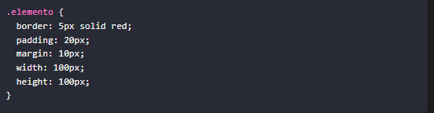

<!-- No borrar o modificar -->
[Inicio](./index.md)

## Sesión 9 

Actividad: Propiedades de espaciado y unidades de medida
Objetivo:

Practicar el uso de las propiedades de espaciado margin, padding, border y border-radius, con diferentes unidades de medida.

1. Crea un nuevo archivo HTML y CSS.

2. En el archivo HTML, agrega el siguiente código:

3. En el archivo CSS, agrega el siguiente código:

4. Abre el archivo HTML en tu navegador. Verás un cuadrado de 100x100 píxeles.

5. Practicar el uso de las propiedades de espaciado.

6. Margin: Agrega un margen de 10 píxeles a todos los lados del elemento.

 * Padding: Agrega un relleno de 20 píxeles a todos los lados del elemento.

 * Border: Agrega un borde de 5 píxeles de color rojo.

 * Border-radius: Agrega un radio de esquina de 10 píxeles. 
  

 * Unidades de medida: Prueba diferentes unidades de medida para las propiedades de espaciado. Por ejemplo, puedes usar unidades porcentuales (%) para establecer un margen o relleno del 50%.

 

## Preguntas

## ¿Qué es la propiedad margin?

La propiedad margin se utiliza para controlar el espacio alrededor de un elemento. Puedes definir márgenes en la parte superior, derecha, inferior e izquierda del elemento.

márgen de 10 píxeles arriba, 20 píxeles a la derecha, 15 píxeles abajo y 5 píxeles a la izquierda del elemento.

## ¿Qué es la propiedad padding?

La propiedad padding se utiliza para controlar el espacio entre el contenido de un elemento y su borde.

Al igual que con margin, puedes definir rellenos en la parte superior, derecha, inferior e izquierda del elemento.

Se establecen los rellenos

## ¿Qué es la propiedad border?

La propiedad border se utiliza para definir el borde de un elemento. Puedes especificar el ancho, el estilo y el color.

Esto crea un borde sólido de 2 píxeles de ancho en color negro alrededor

## ¿Qué es la propiedad border-radius?

La propiedad border-radius se utiliza para controlar la curvatura de las esquinas de un elemento, como un cuadro. Puedes especificar un valor para redondear las esquinas.

## ¿Qué unidades de medida se pueden utilizar para las propiedades de espaciado?

Estas unidades te permiten ajustar el espaciado y los bordes de los elementos de una página web de acuerdo a tus necesidades y preferencias de diseño.

Para las propiedades margin, padding, border-width, y border-radius, puedes usar diversas unidades de medida, incluyendo:

* Píxeles (px)

* Porcentaje (%)

* Em (em)

* Rem (rem)

* Puntos (pt)

* Pulgadas (in)

* Centímetros (cm)

* Milímetros (mm)

[Siguiente](./sesion10.md)
